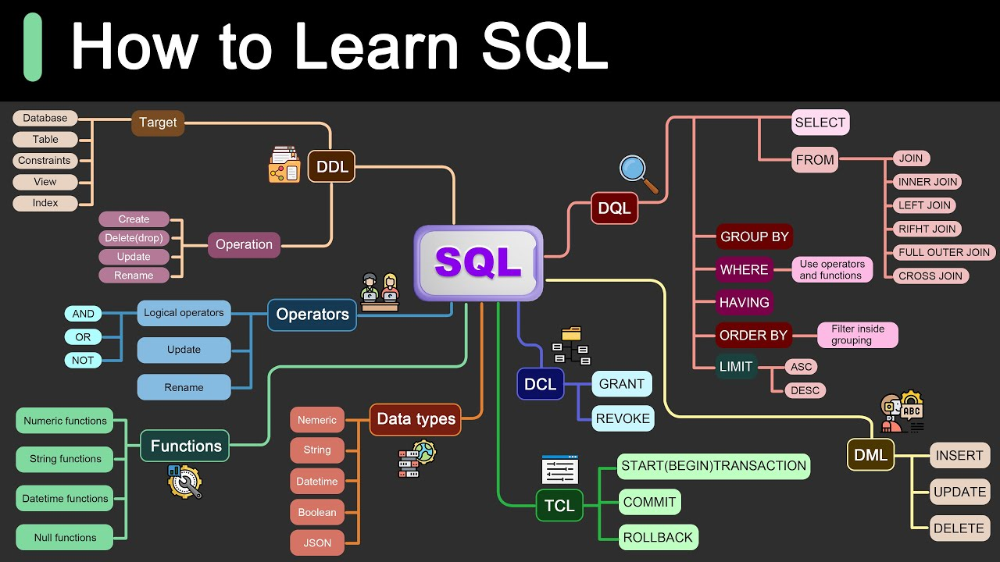

<h2>
<b><i> KEYWORD</i></b> 

</h2>

>* 
SELECT 

>* 
FROM

>* 
 WHERE

>* 
NULL

>* 
NOT

>* 
IS

>* 
CREATE TABLE 

>* 
DISTINCT

>* 
ORDER BY ASC  DSC

>* 
AND

>* 
OR

>* 
INSERT INTO
 
>* 
VALUES

>* 
UPDATE

>* 
DELETE

>* 
IN 

>* 
BETWEEN

>* 
SELECT TOP

>* 
As

>* 
GROUP BY

>* 
JOIN  

#

<h2>
 AGGREGATE FUNCTION
 
</h2>

* 
MAX( )
* 
MIN( )
* 
 SUM( )
*  
 AVG( )
* 
 COUNT( ) 

<h2>
WildCard
</h2>

[1] _ =single character 
[2] % = multiple characters  

 
<h3 style="color:magenta">
For Example
</h3>

 
<code>

%k= Ends with k 
k%= starts with k 
%k%= it contains k 
_k% = k in second position 
__k% = it contains at least 3 characters 
L__nd_%=starts with L and 4th 5th place hold nd  
'[bsp]%'= starts with b || s || p 
[a-f]%= from a to f  
</code>

 Database
  

* 
CREATE DATABASE

* 
 DROP DATABASE  

* 
 BACKUP DATABASE 

<h3>
 Table</h3>  
 

* 
CREATE TABLE  

* 
DROP TABLE

* 
 TRUNCATE TABLE

* 
ALTER TABLE

* 
Constraint(NOT NULL, PRIMARY KEY,FOREIGN KEY,UNIQE)

# [Link: To learn SQL](https://www.w3schools.com/sql/)

